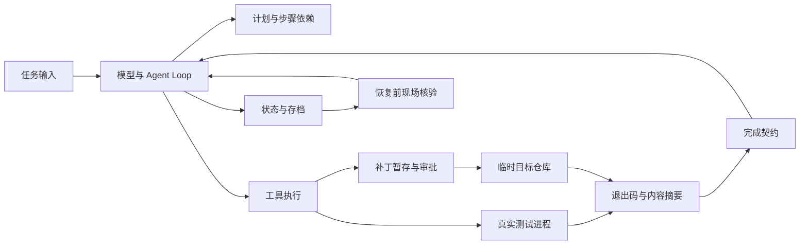

# 工程结构与设计边界

本仓库是课程示例集合，不是一个统一启动的产品。相邻版本重复代码，是为了展示新增一层能力后行为怎样变化；工程整理保留这些对照，把完整入口、检查方法和限制写清楚。具体文件的可运行性见[课程指南](course-guide.md)，配置见 [DeepSeek 接入](deepseek.md)。

## 从一次任务看分层

以“修复登录会话过期判断”为例：模型根据源码和测试结果提出下一步；Runtime 决定工具是否可执行并执行；计划层记录步骤依赖；状态与存档记录现场；完成契约检查最终代码、测试和交付物。模型返回“已经完成”只是一次输出，不能替代这些检查。

| 层 | 输入和输出 | 主要职责 | 不能替代什么 |
| --- | --- | --- | --- |
| 模型适配 | 消息、工具声明 → 文本或工具提议 | 处理供应商协议、鉴权和流式事件 | 业务授权、文件写入、验收 |
| Tool Runtime | 工具 ID、参数、主机上下文 → 结构化结果与证据 | 校验、权限、执行、错误归一化 | 操作系统或容器隔离 |
| Agent Loop | 上下文和工具结果 → 下一轮模型请求 | 迭代、取消、轮数与重复动作保护 | 可靠的完成标准 |
| Planning | 目标、步骤、依赖、证据 → 计划快照 | 有序推进和可解释修订 | 真正执行和测试 |
| State / Checkpoint | 状态、现场摘要、执行记录 → 恢复判断 | 判断能否续跑、哪些操作结果不明 | 自动撤销外部副作用 |
| Completion Contract | 当前内容和各范围的最近结果 → 缺项清单 | 阻止旧证据、空交付物和提前结束 | 判断未定义的业务正确性 |
| Sandbox | 文件、命令、网络、资源策略 → 受限制的执行环境 | 限制允许动作的实际影响 | 业务权限和最终验收 |

读文件越界先看 Runtime 的路径与允许列表；具体补丁未被批准看审批记录；文件或网络被隔离环境拒绝再看 Sandbox 策略。各工具按动作性质组合检查，没有一条适用于所有工具的固定审批顺序。

这些层的关系是组合关系。提示词要求“不要访问敏感文件”不能替代 Runtime 的路径检查；Runtime 拒绝某个路径也不能证明宿主操作系统已被隔离。

## 第一周：从调用协议到输出协议

### Chat、Responses 和 Streaming

`1-2/chat.py` 观察 Chat 的 `messages`、`finish_reason` 和 `usage`；`responses.py` 观察 Responses 的 `input`、`status` 和类型化 `output`。当前 DeepSeek 的 Responses 是无服务端会话存储的接口，客户端需发送完整历史；不能根据响应 ID 推断服务器会保留对话。[官方 Responses 说明](https://api-docs.deepseek.com/guides/responses_api/)。

`1-3/app.py` 再把一次生成与浏览器订阅拆开：`POST /v1/runs` 创建运行，`GET /v1/runs/{runId}/events` 订阅或重放事件，`POST /v1/runs/{runId}/cancel` 显式取消。浏览器断开订阅后运行可以继续；刷新时重复 POST 则会创建另一笔模型调用。事件和运行状态存在当前进程内，服务重启后不能恢复。

这里的事件重放与第三周业务恢复解决不同问题：前者让客户端补看已发生的输出，后者决定已经发生的文件修改和工具执行能否继续。

### 三层输出校验

完整入口为 `1-5/deepseek_structured_demo.py`：

1. Responses `text.format` 把期望 JSON Schema 发给供应商。
2. Pydantic 严格解析，拒绝额外字段、错误类型、非法动作和长度越界。
3. 业务校验要求 `search_docs` 有 query 且 answer 为 null，`finish` 有 answer 且 query 为 null。

例如 `{"action":"finish","query":null,"answer":null}` 在字段层看起来齐全，业务层仍必须拒绝。模型没有资料时返回 `search_docs`，只是有效的下一步决策，尚未完成查询。

格式或业务校验失败时，示例把错误反馈给模型，默认最多纠错一次。网络错误不会进入格式纠错循环；不把“重发 HTTP 请求”和“要求模型修复 JSON”混成同一个重试策略。这里未引入缓存降级或真实搜索，旧片段中的这些概念仍需结合课件组装。

### 两个 Gateway 版本

`1-6/gateway.py` 使用自有 `/v1/llm` 协议，是一个原型：模型白名单、Prompt 选择、有限重试、JSON 模式和进程内 Trace。默认主备路由都使用 `deepseek-flash`，备用需要单独配置密钥；同一供应商并不能隔离供应商整体故障。它不提供 1-7 的持久化用量、统一鉴权或模型目录。

`1-7/llm-gateway` 提供 OpenAI 兼容入口，调用链是：

| 文件/对象 | 工作内容 | 失败怎样传播 |
| --- | --- | --- |
| `app/main.py` | 生命周期创建配置、账本、Prompt、Router、Client、Service | 初始化失败影响 readiness |
| `api/routes.py` | HTTP 解析、鉴权、限流、依赖注入 | 入参错误 422；鉴权错误 401 |
| `GatewayService.prepare_body` | 校验 Schema，渲染版本化 Prompt，去掉网关字段 | 调用方非法 Schema 在访问上游前返回 422 |
| `ModelRouter.candidates` | 按协议、开关、熔断与策略选择候选 | 没有可用路由时明确失败 |
| `UpstreamClient` | HTTP 请求、连接生命周期、供应商错误包装 | Service 决定是否重试或换候选 |
| `structured.py`、`usage.py` | 非流式结果校验与纠错；写用量记录 | 无法修复时 422；价格缺失时成本字段为 0 |

Schema 自身是否合法与输出是否符合 Schema 是两次不同检查。前者用 `jsonschema` 的方言选择和 `check_schema`，不能把它当作任意供应商都接受此 Schema 的证明。[jsonschema 文档](https://python-jsonschema.readthedocs.io/en/stable/validate/)。

流式输出一旦向客户端发送数据，就不能无损重试或换另一模型续写。网关在首块之前处理可重试失败；发送后报告错误并结束。流式结果不会经过完整的本地 Schema 校验与纠错。可选 Stream Checkpoint 保存的是生成正文，默认关闭；用量表不保存 Prompt 正文。

当前默认配置只有一个官方 DeepSeek 上游；`smart`、`fast` 是公开别名。成本、Prompt 版本、限流和 fallback 仅对经过网关的请求生效。六个第三周 Agent 的默认路径是官网直连。

## 第二周：工具声明与执行分开

`2-1/minimal_tool_loop.py` 展示基本循环：模型提出调用 → Python 校验并执行 → 按调用 ID 回传 → 继续推理。工具 JSON Schema 描述参数，但授权信息由宿主上下文提供，不能让模型自己声明权限。

`2-2/tool_runtime_demo_v2.py` 把定义、注册表、快照和 Runtime 分开。快照让模型看到一组确定的工具版本；运行时重新检查开关、依赖和权限，旧快照不能绕过紧急停用。准备失败同样进入结果封装与审计，模型得到可关联原调用的结构化错误。

`2-3` 的完整 MCP Host 将发现、白名单、参数校验、执行预算和结果回传分开；MCP Server 返回的内容仍是不可信输入。[本章 README](../course_code/week02/2-3/README.md)提供锁定 SDK v2 及传递依赖的独立环境；根检查与 CI 已加入真实 stdio 契约和模型 HTTP Mock。完整 Host 的官方模型查询也已联调，HTTP 传输及工单变更仍未验收。函数、错误语义和对应测试见 [MCP Host 链路](mcp-host.md)。

`2-4` 保留了 v1、v2 和较完整的演示，三者能力不同。v2 的测试主要覆盖参数校验、白名单/权限、执行错误和审计脱敏；较完整演示另有审批、风险分类及超时处理。不要根据章节主题把每一版都描述成已实现所有治理功能。

`2-5` 是两个 ZIP 对照工程，包含“带超时问题”和“修复后”版本，未作为展开后的独立项目接入 Make。需要先在临时目录解压并核对各自依赖，不能直接按 `.py` 入口运行。

对有副作用的工具，超时只说明调用方没有得到完整结果，并不证明操作没有发生。重试前需要幂等键、结果查询或人工核查；这个原则也影响第三周的恢复逻辑。

## 第三周：计划、证据和恢复

### 版本演进

| 版本 | 新增职责 | 用什么观察变化 |
| --- | --- | --- |
| 3-1 Codebase | pi Loop、Runtime 投影、轮数与重复保护 | 读取源码并生成 `login-flow.md` |
| 3-2 Planning | 步骤依赖、证据、原子修订、完成契约 | 对照无计划与有计划的修复任务 |
| 3-3 State | 状态迁移、业务存档、审批、恢复和重跑 | 中断后核验现场，拒绝结果不明的写操作 |
| 3-5 Harness | 内容绑定证据、真实测试进程、取消传播、恢复现场核验 | 当前代码是否真的通过所有约定范围 |

早期项目的 `npm start` 可能直接操作其 fixtures，故建议在临时副本里运行。完整 Harness 入口会复制 fixtures 到独立工作区；离线实验与真实模型共用 CLI、Runtime 和完成契约，替换的是提供下一步动作的模型。

### 什么算有效证据

完成契约读取 Runtime 提供的现场，不接受模型自报的哈希。修改证据必须对应当前目标源码；交付文档必须存在、非空，且内容与最后写入证据一致。

测试至少覆盖 `target`、`boundary`、`regression` 三个范围。每个范围先取最近一次尝试，再判断 `resultCode`、退出码、稳定性和摘要。例如先通过、随后同范围超时，旧通过不能继续用于交付；测试通过后又修改源码、测试或配置，也需要重跑。

`r1` 只是当前运行内的业务版本标识，不是 Git 提交。内容摘要用来证明记录与当前文件一致；它无法证明测试已经覆盖所有业务情况。

### 审批和恢复

`approval.ts` / `approval-flow.ts` 暂存具体补丁并绑定摘要，审批对象是这份内容。文件变化后需要重新核验，不能拿先前的“同意修改”批准另一份补丁。

`checkpoint.ts` 保存业务状态；`journal.ts` 记录已启动和已结束的操作；`resume.ts` 先检查存档、工作区、任务状态和执行记录，随后才还原对象并续跑。上次动作分为已完成、未开始、结果不明三种状态。启动过但没有结束记录的写操作不得自动重放。

`--pause-after N` 在完整轮次和存档结束后暂停，支持续跑；SIGINT 进入取消终态。`--resume` 继续同一现场，`--replay` 用原任务和当前课程 fixtures 创建独立现场，两者不能混用。resume 不会重建缺失的目标 repo，现场缺失会拒绝恢复；需要重新开始时使用 replay。完整命令见 [Harness README](../course_code/week03/3-5/harness_agent/README.md)。

当前文件与测试操作在宿主机执行。POSIX 使用进程组清理测试子进程，应用层路径限制和审批仍不能替代 Sandbox；符号链接、网络、资源限制与多租户隔离需要实际沙箱部署验证。

`test-process.ts` 先发送 TERM，再按宽限期发送 KILL，并等待输出管道关闭及进程组消失。macOS 的进程组回收可能短暂返回 EPERM，此时继续核查；持续权限错误或管道不关闭则在清理期限后失败。这里优先保留“无法确认”的失败结果，避免把尚存活的测试进程记成正常结束。[Apple XNU 的进程组信号实现](https://github.com/apple-oss-distributions/xnu/blob/main/bsd/kern/kern_sig.c)。

## Commerce：同一结果有两个消费者

Commerce 保留 Anthropic Apache-2.0 版权和分包结构。核心业务位于 `shopping-agent/core`、`merchant-agent/core`，Messages Runtime 处理手写多轮调用，`examples/demo_common` 负责会话、SSE 和宿主边界；SDK 与 Managed Agents 是另两条消费路径。

`ToolOutcome` 一面给模型提供工具结果，一面给宿主提供可呈现的结构化事件。前端卡片来自工具事件和服务端已知数据，而不是让模型凭空构造可信 UI 数据。

Shopping 的来源记录限制可操作商品；Merchant 的来源、业务 Guardrail 和主机审批共同控制变更。`stage_*` 写入 ChangeLedger 待处理队列，`apply_change` 才应用，并重新检查限制；会话里“用户说同意”不能替代宿主批准的 change ID。

本 fork 只在本地 Messages 示例部署层增加 DeepSeek 配置。主模型、记忆和分析委派统一为 Flash，保留核心门禁；原生托管工具关闭，平台部署材料保持原要求。后端和会话是演示实现，不能直接当作真实电商认证、支付或持久化方案。

## 工程整理的选择

依赖沿用原边界：Gateway 与 MCP Host 各有 `uv.lock`，六个 Agent 有 `package-lock.json`，Commerce 使用固定版本与本地包；第二周其余工具示例仍是范围依赖。根 Make 与 CI 统一运行检查，不把全部项目强行合并成一个包。

这种选择保留了逐版比较和独立启动，代价是模型接入代码需要在六个项目同步维护。因此连接测试按同一契约核对默认模型、地址、鉴权和实际请求体；只更新一个版本会留下可检测的差异。

| 具体问题 | 设计选择与取舍 | 当前结果依据 |
| --- | --- | --- |
| 模型可能用旧测试结果宣布修复完成 | 完成契约绑定当前内容，并取每种范围的最近尝试；需要重跑测试和计算摘要 | Harness 离线回归、真实 Flash 修复后的三种测试范围及交付物 |
| 崩溃可能发生在写文件之后、存档之前 | 分开保存现场和执行记录，结果不明时停止自动续跑；牺牲无条件恢复，避免重复副作用 | 中断回归拒绝自动重复补丁；实际暂停/续跑来自离线实验 |
| Commerce 的业务 Runtime 已与 Anthropic 工具协议结合 | 在示例部署层接入官方 Messages 兼容协议，复用业务核心；兼容范围需要单独验证 | 四行业配置回归与零售两角色单轮联调，尚无托管部署结论 |

本轮工程化贡献是接入、校验、复现与说明。原课程结构、pi 和 Commerce 的核心实现来自上游；当前结果没有生产上线、性能增益或业务收益的统计证据。

本轮注释集中解释协议能力、配置来源、预算含义、错误传播、证据和恢复条件。历史真实运行记录、课件及压缩包按当时背景保留，不因默认模型变化而改写原实验结论。

本机和真实接口的当前证据见[验证记录](verification.md)。未覆盖的 Web、Docker、Sandbox 和托管部署应各自验收，不能由后端测试通过推导为已完成。

## 文档与源码怎样保持对应

深入说明分为 [结构化输出](structured-output.md)、[MCP Host](mcp-host.md) 与 [Harness 生命周期](harness-lifecycle.md)。每份沿入口、函数、状态变化、失败分支和测试阅读；概览负责导航，细节在对应链路维护。

[`code-map.json`](code-map.json) 声明文档小节、源码文件、关键符号和验证测试；[`check_docs.py`](../scripts/check_docs.py) 检查小节与文件存在、符号仍在源码定义中、同一小节说明符号并链接源码和测试。Python 用 AST 核对类/函数/方法；TypeScript 屏蔽注释和字符串后核对具名 export，不核对内部方法或类型语义。实际行为和类型仍由 pytest、Vitest、tsc 与人工复核负责。

`make check-docs` 同时运行检查器的 [9 个回归用例](../scripts/test_check_docs.py)，覆盖重命名、伪声明、失效标题、缺测试和遗漏链接。它不会执行 Markdown 代码块，也不自动证明文字描述的业务语义；改预算、结果字段和恢复条件时，仍须同步函数说明、反例与真实验收记录。新增完整链路时再增映射，历史片段不强行套入完整项目契约。
