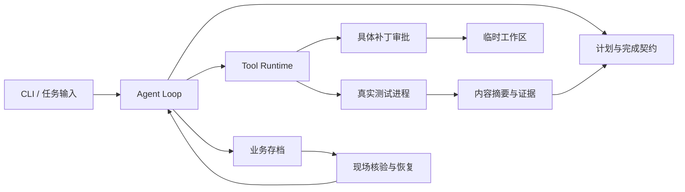

# 项目分析与工程化整理

## 仓库定位

本 fork 基于 `Blackoutta/ai-agent-fullstack-training`，本轮分析的上游提交为 `15f2eef`。原始仓库包含 907 个文件，主要是 297 个 Python 文件、217 个 TypeScript 文件、142 个 TSX 文件，以及 17 份 PDF。`course_materials/` 是课件，`course_code/` 是逐阶段示例，`fqa/` 保存特定模型接口问题的复现材料。

课程从模型访问逐渐增加工具治理、计划、恢复与 Harness。重复目录体现不同阶段的能力差异，阅读时沿课程顺序比较；工程增强优先落在完整版本并保留前后对照。

| 范围 | 主体 | 阅读重点 |
| --- | --- | --- |
| Week 01 / 1-1 至 1-5 | 单文件 Python 示例 | API、流式事件、Prompt、输出协议 |
| Week 01 / 1-6 | Gateway 原型 | 统一调用入口与适配层 |
| Week 01 / 1-7 / llm-gateway | FastAPI 服务 | 路由、fallback、结构化纠错、SQLite 用量账本 |
| Week 02 / 2-2、2-4 | Tool Runtime 与治理 | 工具快照、参数校验、权限、审批、超时和审计 |
| Week 03 / 3-1 | Codebase Agent | pi Loop 与工具执行边界 |
| Week 03 / 3-2 | Planning Agent | 计划依赖、证据与完成契约 |
| Week 03 / 3-3 | State / Checkpoint | 显式状态、原子存档、恢复与补丁审批 |
| Week 03 / 3-4 | Sandbox | 本机与容器执行边界 |
| Week 03 / 3-5 / harness_agent | 最终 Harness | 内容绑定证据、取消传播、恢复现场核验 |
| Week 03 / 3-5 / commerce-agents | Anthropic 参考工程 | Shopping / Merchant 共用契约与四种行业示例 |

## Gateway 的代码调用链

从 `app/main.py:create_app` 开始：生命周期创建 Prompt Repository、Usage Repository、Router、Upstream Client 和 Gateway Service，并装入 `app.state`。

1. `app/api/routes.py`：Pydantic 解析 HTTP 输入，依赖注入执行鉴权和限流。
2. `GatewayService.prepare_body`：检查输出 Schema，去掉网关专用字段并渲染版本化 Prompt。
3. `ModelRouter.candidates`：过滤协议、开关与熔断状态，给出首选和 fallback。
4. `UpstreamClient`：执行 HTTP 调用；`GatewayService` 控制有限重试、结构化修复与流式转发。
5. `structured.py`：验证模型输出；`usage.py`：记录用量、耗时与配置价格计算出的成本。

调用方非法 Schema 属于请求错误。修复后，Chat Completions 和 Responses 的 JSON/SSE 请求都在访问上游前返回 422，错误码为 `invalid_json_schema`。合法的空 Schema `{}` 和已支持的结构化纠错仍然可用。

Schema 检查使用库提供的方言选择与 `check_schema`，依据 [jsonschema 官方文档](https://python-jsonschema.readthedocs.io/en/stable/validate/)。该检查验证 Schema 的结构；具体供应商的 Schema 子集、外部引用策略和模型能力仍由部署方约束。

## Harness 的代码调用链

建议阅读顺序：

- `src/cli.ts`、`src/run-context.ts`：理解新运行、暂停、恢复、重跑和工作区路径。
- `src/agent-runner.ts`、`src/pi-tools.ts`：查看 Loop Hook 与模型工具到 Runtime 的投影。
- `src/runtime.ts`、`src/test-process.ts`：检查补丁、取消、超时、进程组终止和真实退出码。
- `src/plan-store.ts`、`src/completion-contract.ts`：查看步骤依赖及完成证据判定。
- `src/task-record.ts`、`src/checkpoint.ts`、`src/resume.ts`：查看状态迁移与恢复现场核验。
- `src/approval.ts`、`src/approval-flow.ts`：查看批准内容与文件内容哈希的绑定。

最终 Harness 新增 `GATEWAY_MODEL` 配置，用于选择 Gateway 已公开的模型别名；缺省仍为课程原来的 `agent-default`。接入 1-7 Gateway 可设置为 `smart`，具体步骤见 [Harness README](../course_code/week03/3-5/harness_agent/README.md)。

## 已落地的工程改进

| 原问题 | 改动 | 验证方式 |
| --- | --- | --- |
| 非法 Schema 可导致未处理异常或被流式请求直接转发 | 提前校验两种 API 的格式与 Schema，返回明确 422 | 30 个错误用例先复现失败，再通过；另有 2 个合法请求用例 |
| 六个 Agent 的锁文件不满足干净安装 | 补齐平台包并修正 esbuild 的依赖布局，保留已有依赖版本 | 六个项目的 `npm ci`、测试和编译 |
| Gateway 文档引用不存在的 `.env.example` | 添加占位配置模板 | 模板路径和 Git 忽略规则检查 |
| 最终 Harness 固定别名与 Gateway 示例配置不一致 | 添加 `GATEWAY_MODEL` 与模板 | 默认值、覆盖值和空值回退测试 |
| 缺少根目录工程入口 | 添加 Make、版本提示、EditorConfig、中文开发说明 | 目标命令实际执行、语法与差异检查 |
| 缺少统一 CI | 添加 Gateway、Tools、六个 Agents、Commerce 离线 jobs | 本机执行对应命令；远程状态看 Actions 页面 |
| 最终 Harness 缺少 README | 补充离线实验、联调、模块职责与恢复入口 | 固定动作实验完成暂停、续跑和交付 |
| 注释缺少职责说明 | 补充配置、路由、Schema 与调用编排的设计注释 | Gateway Ruff 与回归测试 |

## 验证范围

本机环境：macOS、Node.js 24.14.0、Python 3.12.14。CI 使用 Linux、Node.js 22.19.0 与 Python 3.12。测试数是本次验证结果，后续可能增加。

| 模块 | 通过测试数 | 其他检查 |
| --- | ---: | --- |
| Gateway | 38 | 锁定依赖、Ruff |
| Tool Runtime / 2-2 | 3 | 离线执行 |
| Tool Governance / 2-4 | 19 | 离线执行 |
| 3-1 / codebase_agent_demo | 6 | TypeScript 编译 |
| 3-1 / codebasedemo | 33 | TypeScript 编译 |
| 3-2 / codebase_agent_demo | 6 | TypeScript 编译 |
| 3-2 / planning_agent_demo | 18 | TypeScript 编译 |
| 3-3 / planning_agent_demo | 33 | TypeScript 编译 |
| 3-5 / harness_agent | 56 | TypeScript 编译、脚本化 Harness 闭环 |
| Commerce Python | 1104 | 1 个原有行业契约用例按适用条件跳过；Ruff、一致性脚本 |
| 合计 | 1325 | 六个 Agent 的生产依赖 npm audit 均为 0 条已知漏洞 |

npm audit 使用官方 registry 查询（2026-10-02），覆盖六个课程 Agent 的生产依赖。它的结果不能替代安全审查，也未覆盖 Commerce Web 或 Python 依赖。

独立验收入口：

- Commerce Web：在 `course_code/week03/3-5/commerce-agents/examples/` 执行 `npm ci` 和 `npm run build`，再按行业 README 启动界面。本次未执行八个 Web 应用的构建或浏览器验收。
- Gateway Docker：在 Gateway 目录执行 `docker compose up --build`。本次未执行 Docker 镜像构建。
- Sandbox：按 `course_code/week03/3-4/` 对应课件与演示配置运行。本次未启动 Sandbox 服务。
- 真实模型：配置 Gateway 供应商后运行 Harness 的 `npm start` 或 `npm run lab:cycle`。本次使用离线模型，不消耗真实模型额度。
- 课件 PDF 与早期单文件演示：本次完成目录索引，未逐份审阅课件或运行所有演示。

## 后续工程重点

Gateway 的空 API Key 列表允许匿名开发模式，Prompt、管理接口与流式存档使用同一鉴权入口；实际服务需明确管理员权限、租户隔离和持久化正文的访问控制。限流和熔断只在进程内生效，多副本需要共享状态。

Harness 的路径检查是词法检查，读取与补丁操作仍运行在宿主环境；生产代码执行需要结合 3-4 的 Sandbox，进一步约束符号链接、文件权限、网络和资源。Checkpoint 适用于课堂单运行流程，持久化耐久性和多写入者协调应在服务化时补充。

下一轮可从真实 Gateway 联调、Commerce 前端验收、第二周依赖锁定及容器化验证展开，每次选一条完整链路并添加相应验证。
