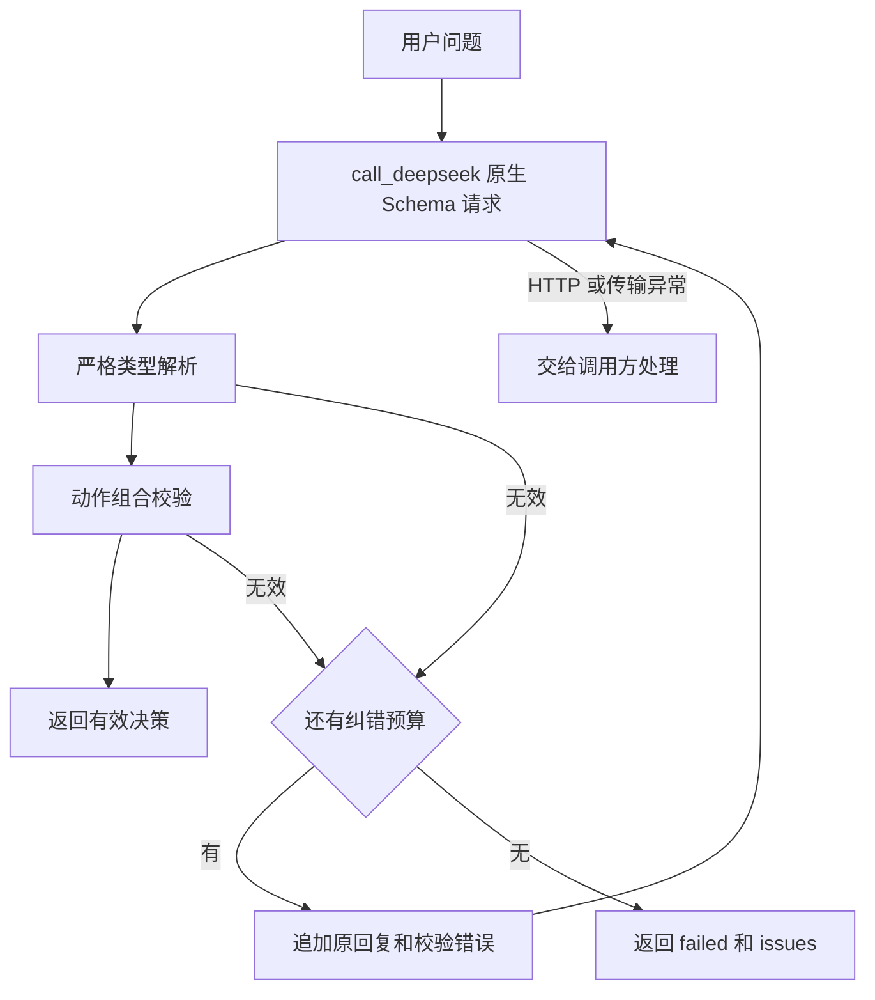

# 从模型文本到有效决策

这一条链路对应第一周的完整入口 [deepseek_structured_demo.py](../course_code/week01/1-5/deepseek_structured_demo.py)。目标是得到可以交给下一层处理的决策对象。示例不连接知识库，不根据模型生成的 query 自动执行工具。

## 决策链路

沿 [完整源码](../course_code/week01/1-5/deepseek_structured_demo.py) 按 `main → decide → call_deepseek → AgentDecision.check_action_fields` 阅读。其中 `decide` 接收一个 `model_call` 函数，真实运行注入 `call_deepseek`，离线测试注入固定回复；业务流程与传输代码由此分开，无需额外框架。

| 位置 | 输入 → 输出 | 负责的检查 |
| --- | --- | --- |
| `call_deepseek` | 消息列表 → 模型 JSON 文本 | 官方 Responses 请求；HTTP 200；响应必须 completed；提取 output_text |
| `decide` | 问题、调用函数、纠错预算 → `DecisionResult` | 严格解析；保留失败原因；有限纠错；传输异常交给调用方 |
| `AgentDecision` | JSON → 类型化字段 | 必须包含 action/query/answer；禁止额外字段；严格类型、动作枚举和长度限制 |
| `AgentDecision.check_action_fields` | 类型化字段 → 有效动作组合 | search_docs 有 query、answer 为 null；finish 有 answer、query 为 null |
| `main` | CLI 参数 → JSON 和退出码 | ok 返回 exit 0，failed 返回 exit 1；纠错次数只允许 0..3 |

[`test_deepseek_structured_demo.py`](../course_code/week01/1-5/test_deepseek_structured_demo.py) 对应五个关键场景：字段齐全但业务组合无效、一次修复成功、预算耗尽、传输错误只调用一次、search_docs 不执行工具。测试证明本地边界；供应商是否接受 Schema 还需真实接口验证。



## 三层校验为什么都保留

原生 JSON Schema 限制生成形式，但不同供应商支持的子集会变化。本地 Pydantic 保证进入程序的字段符合类型；动作组合再保证决策可以解释。`{"action":"finish","query":null,"answer":null}` 能被 JSON 解析，字段也齐全，却无法提供最终答案，因此必须在业务层拒绝。

两个有效结果分别是：

```json
{"action":"search_docs","query":"差旅报销材料","answer":null}
```

```json
{"action":"finish","query":null,"answer":"根据已提供的制度，需要发票和审批单。"}
```

这些是协议示例。当前校验没有核查答案是否有来源、query 是否有业务价值，也允许只包含空白字符的非空字符串；不要据此声称已经验证事实正确性。业务需要更严格规则时，在模型校验器增加明确条件，并用具体反例验证。

## 纠错与失败传播

`repair_attempts=1` 表示最多调用模型两次：初始一次，校验失败后再纠错一次。`DecisionResult.repair_attempts` 记录已用纠错次数，首次成功为 0。失败结果没有 decision，带有 issues；调用方应依据 status 分支，不能直接访问一个假定存在的答案。

纠错上下文包含原始 assistant 回复和精简校验错误，错误对象去掉原输入与附加上下文，避免重复堆积无关内容。`model_call` 放在捕获 `ValidationError` 的范围之外：HTTP 超时、非 200 和 incomplete 不会被当作 JSON 错误再次发送。有限语义纠错与网络重试必须分别设计。

当前 `call_deepseek` 固定 `/v1/responses`，从进程环境读取 key/model；它不读取 `DEEPSEEK_BASE_URL`。HTTPX 超时配置为 60 秒、输出预算为 800 token，关闭环境代理，设置 `reasoning.effort=none`。它没有缓存、fallback 或跨请求状态存储。配置来源与协议验收见 [DeepSeek 接入](deepseek.md)。

## 运行和修改

在训练营根目录执行：

```bash
make check-reference
uv run --env-file .env --project course_code/week01/1-7/llm-gateway --locked \
  python course_code/week01/1-5/deepseek_structured_demo.py --repair-attempts 1
```

修改字段时同时检查 `AgentDecision`、业务组合、供应商 Schema 和消费结果的代码。新增动作不能只改 Literal；也要定义何时有效、如何失败、由谁执行。当前输出协议适合小型决策器，接入真实检索后仍需由第二周 Runtime 检查授权、参数及结果，并明确检索证据怎样支持最终答案。
